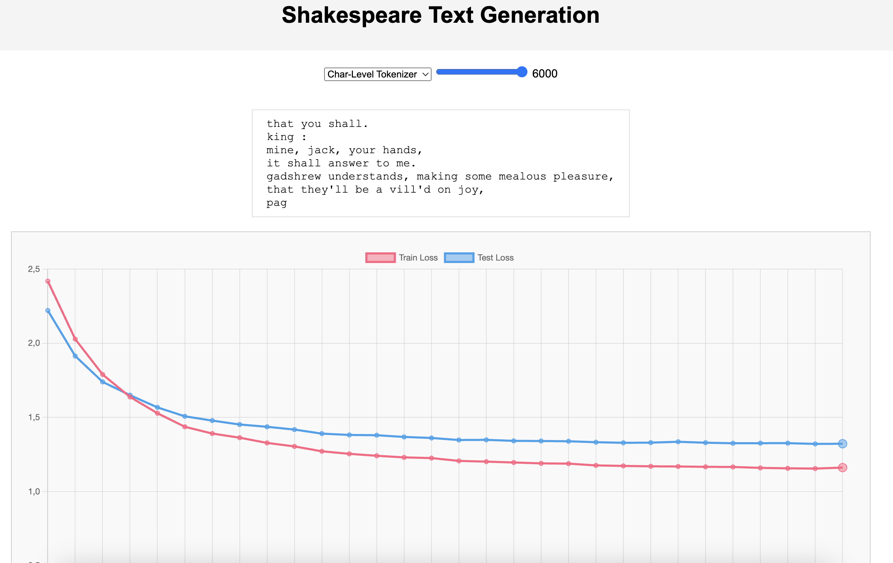

# Shakespeare Text Generation Web App

| | |
|:--|:--|
| **This web application showcases the capabilities of a tranformer model trained for 6000 steps on Shakespearean data to generate text.** |  |

The model has been trained with 3 different tokenizers : 
- character level tokenizer
- word level tokenizer
- bert tokenizer
 Users can interact with the application to see how the models perform at various stages of their training process.

## Model Parameters 

The model is a transformer model trained from scratch, it was inspired by a Andrej Karpathy [video](https://www.youtube.com/watch?v=kCc8FmEb1nY&t=1s).
Model parameters are the following :
Make a table with the parameters of the model

| Parameter | Value |
|:--|:--|
| **Number of Transformer Blocks** | 6 |
| **Number of Attention Heads** | 4 |
| **Embedding size** | 512 |
| **Multi Atttention Dropout** | 0.1 |
| **Attention Dropout** | 0.1 |
| **Batch size** | 64 |

The context lengths was changed depending on the tokenizer used :
- character level tokenizer : 256
- word level tokenizer : 64
- bert tokenizer : 64

## Features

- **Model Selection**: Choose between `char_level_tokenizer`, `word_level_tokenizer`, and `bert_tokenizer` to compare different tokenization strategies.
- **Training Step Slider**: A slider allows you to select training steps (multiples of 200) to see model predictions at different stages of training.
- **Dynamic Text Display**: View the generated text by the selected model, updated character by character for a generative effect.
- **Loss Visualization**: Examine the train and test loss curves for each model, and see how they progress over time.
- **Interactive Graph**: Click on points in the loss graph to update the model output corresponding to that specific training step.

## Use 

You need a browser that supports HTML5 (like Google Chrome, Mozilla Firefox).
You can directly try this app by clicking [here](https://hugodmn.github.io/keyboard_trackpad.github.io/).

